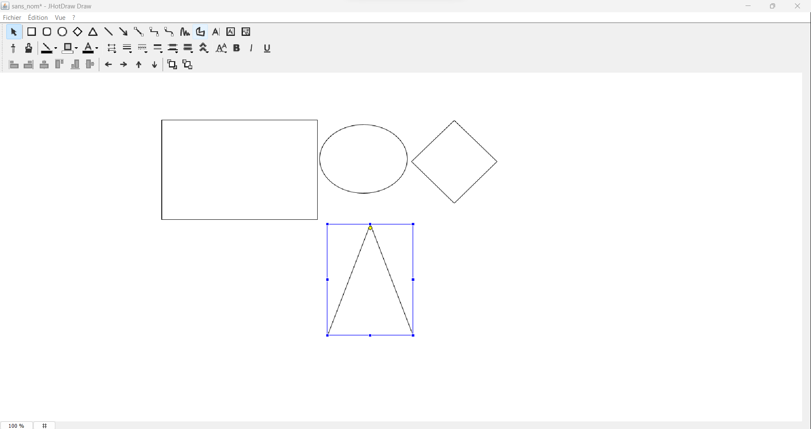
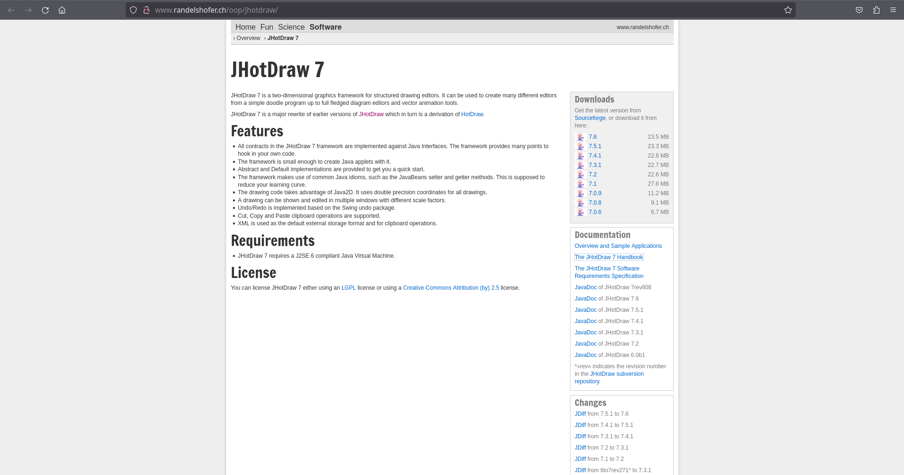
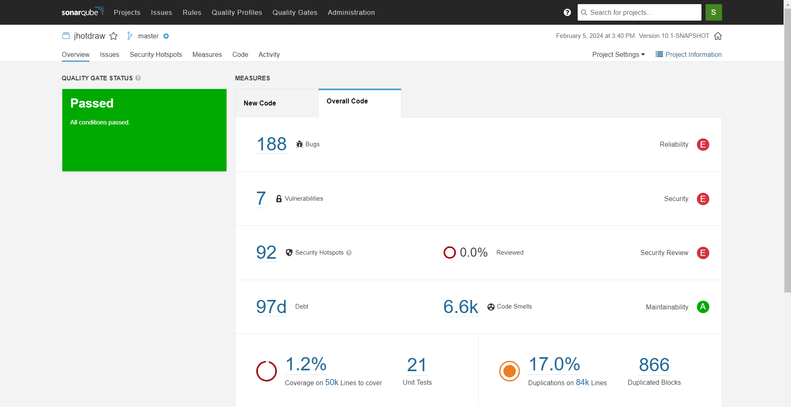

# jhotdraw projet

# Génie logiciel

# Author: PHAM Tuan Anh && Kode Ousmane Omar

# Groupe: 5

# Projet sélectionné : JHotDraw

## 1. Présentation globale du projet

### 1.1 Utilité du projet

- JHotDraw est un framework graphique en deux dimensions pour les éditeurs de dessin, basé sur un logiciel réalisé en 1996.

- HotDraw étant une bibliothèque Java, elle n'est pas livrée avec un exécutable autonome. Cependant, des exemples d'utilisation, également appelés démos, sont fournis dans le répertoire /jhotdraw-samples. Pour expérimenter avec l'un de ces exemples, suivez ces étapes :

1. Placez-vous à la racine du projet.

2. Compilez l'ensemble du projet en utilisant la commande Maven :

```
mv clean install
```

3. Choisissez un exemple à exécuter, par exemple, le programme jhotdraw-samples/jhotdraw-samples-mics/src/main/java/org/jhotdraw/samples/draw/Main.java.

4. Pour simplifier l'exécution sans utiliser la ligne de commande Java, vous pouvez lancer le programme directement depuis un environnement de développement intégré (IDE) tel qu'Eclipse.

Lorsque vous exécutez l'exemple, vous devriez voir une interface graphique représentant une application de dessin basique, comme illustré dans l'aperçu fourni. Cela vous permettra de visualiser les fonctionnalités de JHotDraw et de comprendre comment la bibliothèque peut être utilisée pour créer des applications interactives de dessin et d'édition graphique.



### 1.2 Description du projet

- Le readme est bien structuré et contient toutes les informations nécessaires pour comprendre le projetqui sont : les dernières informations concernant la restructuration de certaines classes, la version de jdk utilisé pour le code, le statut de l'intégration continue avec Maven, les instructions pour commencer à utiliser le projet, la dépendance Maven nécessaire pour inclure le projet dans notre propre espace de travail, Des informations sur des exemples d'utilisation du projet, la licence sous laquelle le projet est distribué , l'histoire et l'origine du projet.

- Plusieurs documentations de jhotdraw ont été publiées. L'une des plus pertinentes se trouve sur le site suivant : `http://www.randelshofer.ch/oop/jhotdraw/`. Vous trouverez sur une section du site des liens qui répertorient diverses informations concerant jhotdraw. (Voir l'image ci-dessous)
  

- Il existe en fait un fichier reame dans ce projet mais il contient très peu d'informations sur l'utilisation de ce projet dans le fichier readme.

## 2. Historique du logiciel

### 2.1 Analyse du git

## 3 Architecture logicielle

jhotdraw-core

### 3.1 Utilisation de bibliothèques extérieures

javax

### 3.2 Organisation en paquetages

compter le nombre de paquetages: 14 et paquetages org.jhotdraw.draw

### 3.3 Répartition des classes dans les paquetages

Le nombre total de classes (dans core):
org.jhotdraw.draw: 14
org.jhotdraw.draw.action: 34
org.jhotdraw.draw.connector: 11
org.jhotdraw.draw.constrainer: 5
org.jhotdraw.draw.decoration: 7
org.jhotdraw.draw.event: 31
org.jhotdraw.draw.figure: 31
org.jhotdraw.draw.handle: 27
org.jhotdraw.draw.io: 5
org.jhotdraw.draw.layouter: 6
org.jhotdraw.draw.liner: 5
org.jhotdraw.draw.locator: 8
org.jhotdraw.draw.print: 2
org.jhotdraw.draw.text: 3
org.jhotdraw.draw.tool: 20
TOTAL: 209 classes

## 4 Analyse approfondie



### 4.1 Tests

Il y a 21 tests:

jhotdraw-core/src/test/java/org/jhotdraw/draw/figure/AttributesTest.java: 1

jhotdraw-core/src/test/java/org/jhotdraw/draw/figure/AbstractFigureTest.java: 2

jhotdraw-utils/src/test/java/org/jhotdraw/geom/path/BezierPathTest.java: 4

jhotdraw-utils/src/test/java/org/jhotdraw/geom/path/MutablePath2DTest.java: 4

jhotdraw-io/src/test/java/org/jhotdraw/io/DOMStorableInputOutputFormatTest.java: 10

### 4.2 Commentaires

Le code contient 17212 lignes de commentaire, soit 17.1% du code

### 4.3 Dépréciation

### 4.4 Duplication de code

Il y a 84000 lignes dupliqués dans tout le projet, soit 17.0% du code. Il y a 866 blocs dupliqués et 237 fichiers dupliqués

### 4.5 God Classes

Il y a un total de 765 classes Java et un nombre total de 7007 fonctions
files: 690
lines: 123183
lines of code: 83718

- le nombre de méthodes par classe:

  - min: 0
  - max: 90
  - moyenne: 9
  - médian: 6

- le nombre de variables d’instances par classe:

  - min:
  - max:
  - moyenne:
  - médian:

- le nombre de lignes de code par classe:
  - min:1
  - max:2243(jhotdraw-samples/jhotdraw-samples-misc/src/main/java/org/jhotdraw/samples/svg/io/SVGInputFormat.java)
  - moyenne: 127
  - médian: 72
- God classes: je pense `SVGInputFormat.java`
  `plusier ligne de code:`
  jhotdraw-samples/jhotdraw-samples-misc/src/main/java/org/jhotdraw/samples/svg/io/SVGInputFormat.java
  3,251
  jhotdraw-gui/src/main/java/org/jhotdraw/gui/action/ButtonFactory.java
  1,982
  jhotdraw-samples/jhotdraw-samples-misc/src/main/java/org/jhotdraw/samples/odg/io/ODGInputFormat.java
  1,928
  jhotdraw-core/src/main/java/org/jhotdraw/draw/DefaultDrawingView.java
  1,580
  jhotdraw-samples/jhotdraw-samples-misc/src/main/java/org/jhotdraw/samples/svg/io/SVGOutputFormat.java
  1,389
  jhotdraw-gui/src/main/java/org/jhotdraw/gui/plaf/palette/PaletteToolBarUI.java
  1,337
  jhotdraw-utils/src/main/java/org/jhotdraw/io/Base64.java
  1,321
  jhotdraw-utils/src/main/java/org/jhotdraw/geom/path/BezierPath.java
  1,221
  jhotdraw-gui/src/main/java/org/jhotdraw/gui/JSheet.java
  1,217
  jhotdraw-core/src/main/java/org/jhotdraw/draw/AbstractDrawingView.java
  1,122
  jhotdraw-utils/src/main/java/org/jhotdraw/io/StreamPosTokenizer.java
  1,072

#### 4.6 Analyse des méthodes

- le nombre de complexité cyclomatique:
  - min: 0
  - max: 462(SVGInputFormat.java)
  - moyenne: 23
  - médian: 20

### sonarqube

```
docker run -d --name sonarqube -p 9000:9000 sonarqube:8-community

mvn org.jacoco:jacoco-maven-plugin:prepare-agent package

mvn org.jacoco:jacoco-maven-plugin:report

mvn sonar:sonar -Dsonar.login=ba45686f7a746dae73676bd0935c86a24ac24f25
```

# jhotdraw

[](https://github.com/wumpz/jhotdraw/actions/workflows/maven.yml)

## News

> **ATTENTION**: Due to the refactoring in 10.0-SNAPSHOT this version breaks API of JHotdraw. Some adaptions are needed, e.g.: attributes now using `attr()`, ...

- heavy restructuring of classes and interfaces and cleanup
  - removed FigureListener from some Figures and Handles
  - complete attribute handling of Figure moved in class Attributes, access over **attr()**
  - Drawing has no dependency to CompositeFigure anymore and implementations do not use
    AbstractCompositeFigure implementations
  - Drawing has its own listener DrawingListener now instead of FigureListener and CompositeFigureListener
  - contains(point, scale) is now called to take view scale into account for finding figures
  - removed DEBUG mode and introduced some logging instead
  - removed DOMStorable from Drawing, Figure
  - introduced a new module **jhotdraw-io** for input output and dom storables
- JDK 17
- maven build process
- restructured project layout
  - introduced submodules

## Quickstart

This projects jars are not yet published to maven central or GitHub packages. To use those you first need to build it with **maven** using: `mv clean install`. Now all jars are published to your local maven repository. And you can include those artifacts using e.g.

```xml
<dependency>
  <groupId>org.jhotdraw</groupId>
  <artifactId>jhotdraw-core</artifactId>
  <version>10.0-SNAPSHOT</version>
</dependency>
```

In module `jhotdraw-samples-mini` are small examples mostly highlighting one aspect of JHotdraw usage.
Additional to that are in module `jhotdraw-samples-misc` more sophisticated examples of using this library.

## License

- LGPL V2.1
- Creative Commons Attribution 2.5 License

## History

This is a fork of jhotdraw from http://sourceforge.net/projects/jhotdraw.
